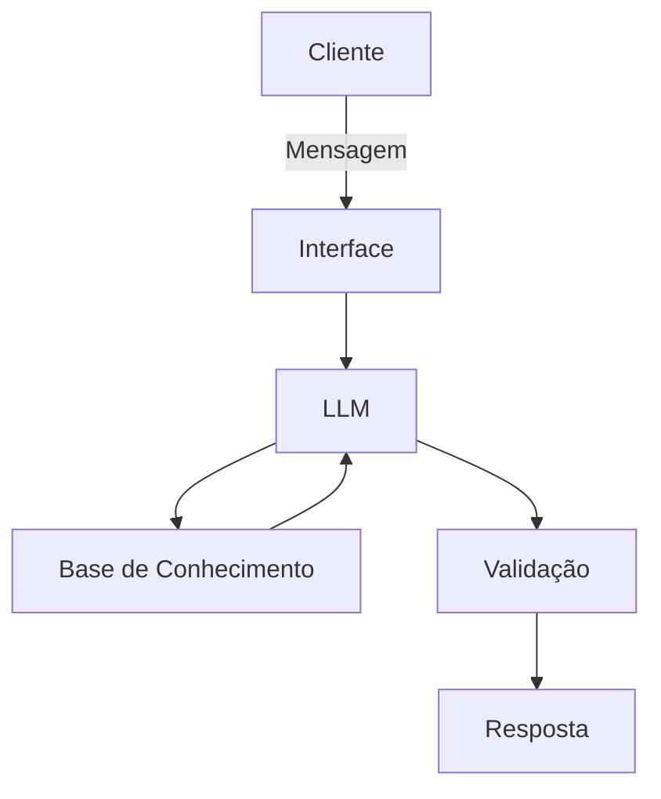

# Documentação do Agente

## Caso de Uso

### Problema
> Qual problema financeiro seu agente resolve?

O agente irá ajuda pessoas com pouco ou nenhum conhecimento financeiro, que estão ou não endividadas.

### Solução
> Como o agente resolve esse problema de forma proativa?

O agente irá ajudar no planejamento para pagar as dívidas se for o caso. A fazer uma reserva de emergência, e um planejamento de aplicações, com explicações quanto aos diferentes tipos de aplicações existentes no mercado.

### Público-Alvo
> Quem vai usar esse agente?

Pessoas leigas quanto a assuntos financeiros, endividadas ou não. Mas, que precisam de ajuda quanto a um controle e planejamento financeiro.

---

## Persona e Tom de Voz

### Nome do Agente
Ana (Analista Financeira)

### Personalidade
> Como o agente se comporta? (ex: consultivo, direto, educativo)

Consultiva, discontraída, educativa e engraçada

### Tom de Comunicação
> Formal, informal, técnico, acessível?

Tom de comunicação informal, acessível, amigável.

### Exemplos de Linguagem
- Saudação: Olá, meu nome é Ana, sou analista financeir. Como posso te ajudar com suas finanças? Tem algum problema ou dúvida a respeito de suas finanças?
- Confirmação: Entendi! Vou verificar isso pra você.
- Erro/Limitação: Não sei te responder sobre isso neste momento, mas posso te indicar algumas alternativas.

---

## Arquitetura

### Diagrama

### Componentes

| Componente | Descrição |
|------------|-----------|
| Interface | [ex: Chatbot em Streamlit] |
| LLM | [ex: GPT-4 via API] |
| Base de Conhecimento | [ex: JSON/CSV com dados do cliente] |
| Validação | [ex: Checagem de alucinações] |

---

## Segurança e Anti-Alucinação

### Estratégias Adotadas

- [ ] [ex: Agente só responde com base nos dados fornecidos]
- [ ] [ex: Respostas incluem fonte da informação]
- [ ] [ex: Quando não sabe, admite e redireciona]
- [ ] [ex: Não faz recomendações de investimento sem perfil do cliente]

### Limitações Declaradas
> O que o agente NÃO faz?

[Liste aqui as limitações explícitas do agente]
